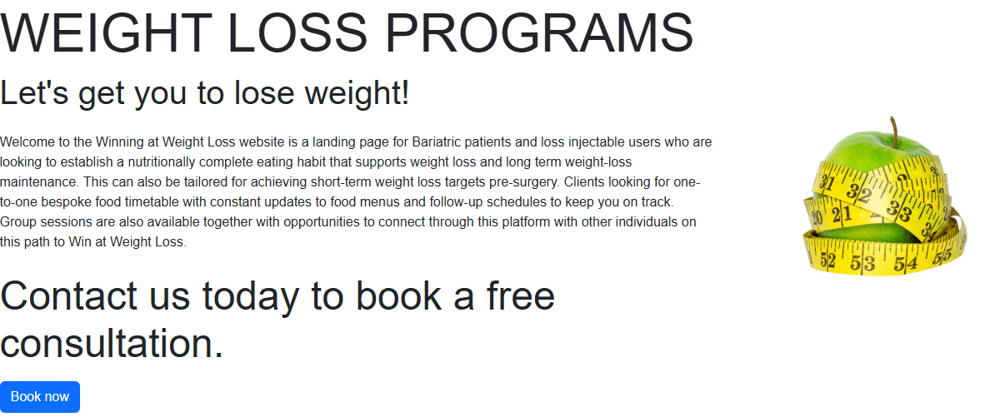
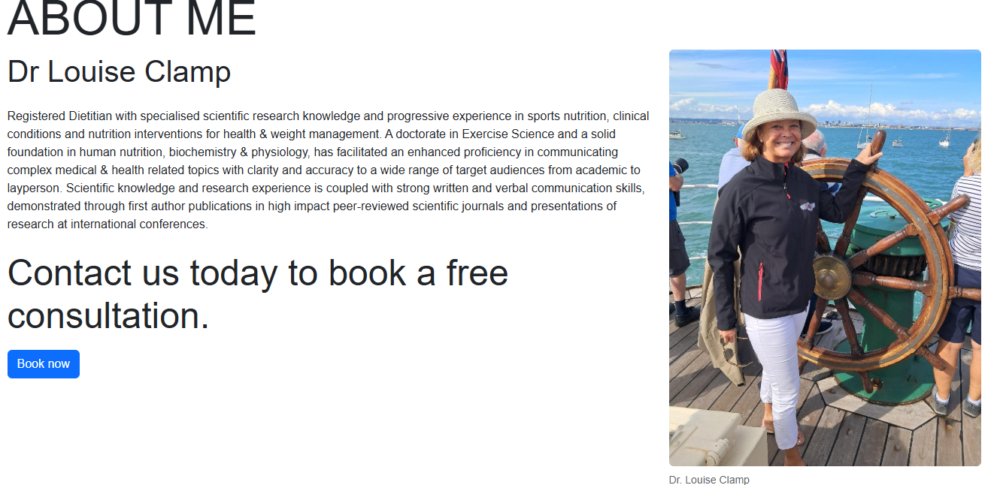
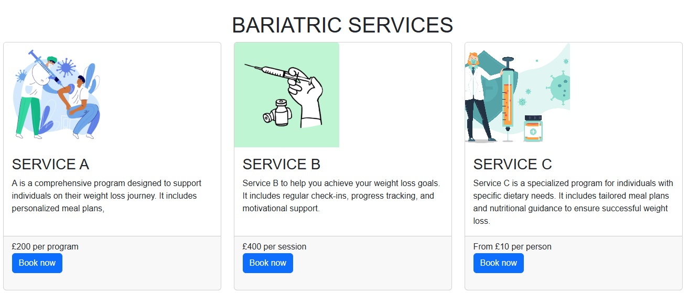
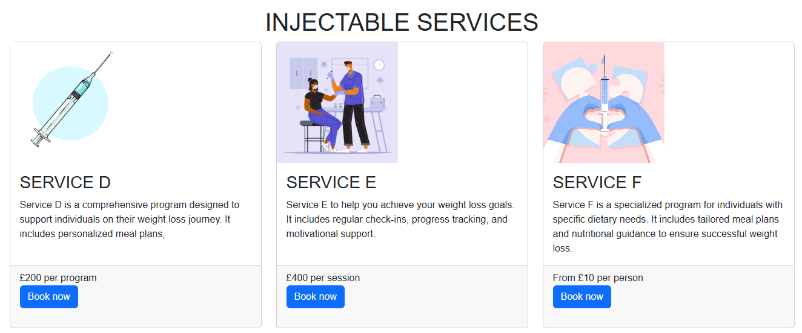
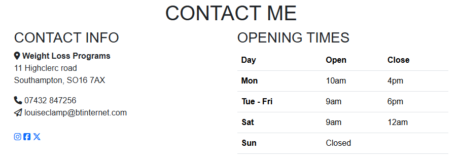
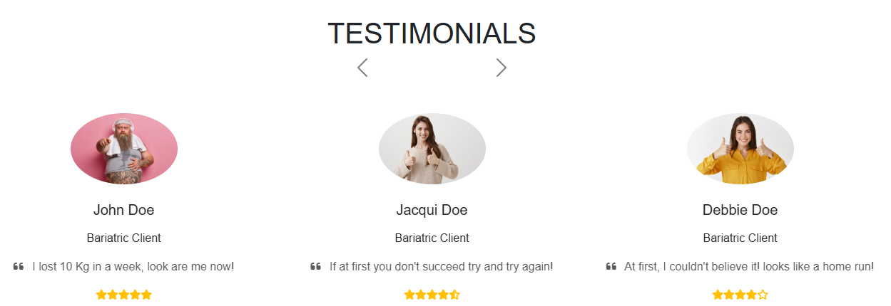
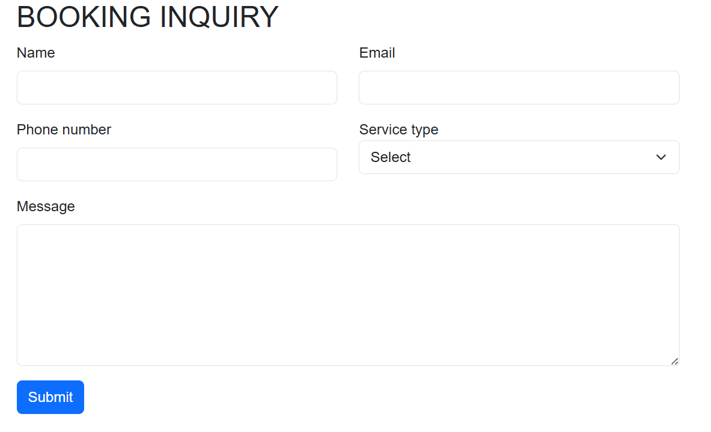
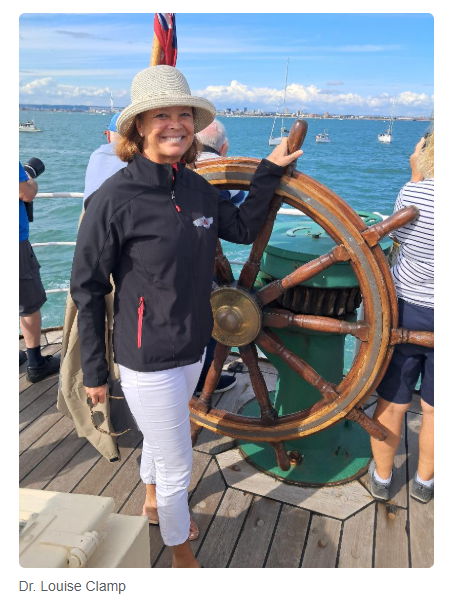

# [new-milestone](https://davidclamp.github.io/new-milestone)

Developer: David Clamp ([DavidClamp](https://www.github.com/DavidClamp))

PROJECT INTRODUCTION AND RATIONALE

The Winning at Weight Loss website is a landing page for Bariatric patients and weight loss injectable users who are looking to establish a nutritionally complete eating habit that supports weight loss and long-term weight-loss maintenance. This can also be tailored for achieving short-term weight loss targets pre-surgery.
Clients looking for one-to-one bespoke food timetable with constant updates to food menus and follow-up schedules to keep you on track. Group sessions are also available together with opportunities to connect through this platform with other individuals on this path to Win at Weight Loss.
This particular project was chosen because my wife, Dr Louise Clamp is a  Dietician who  may look to branch out into the private sector. This website maybe an additional portal for potential clients to aquire specific services. Services that are in a development process.

**Site Mockups**

source: [new-milestone amiresponsive](https://ui.dev/amiresponsive?url=https://davidclamp.github.io/new-milestone)

## UX

### The 5 Planes of UX

#### 1. Strategy

**Purpose**
- Encourage Bariatric patients and weight loss injectable users to sign up for a bespoke diet program. By showcasing the leading dietician and services on offer.
- Provide a seamless user experience to keep users informed and engaged.

**Primary User Needs**
- Bariatric patients and weight loss injectable users need diet plans to manage weight loss.
- Learn about the leading dietician and services provided.
- Contact and arrange a consultation.
- Access responsive, user-friendly content.

**Business Goals**
- Build a significant dietetics 'practice' from a single-based operation.
- Increase practice clients.
- Create a sustainable revenue stream.
- Boost awareness of both post-Bariatric patients and weight injectable users of the importance of proper diet plans to manage weight-loss.

#### 2. Scope

**Content Requirements**
- Clear, consise and informative text about the pratice and main practioners qualifications.
- Outline text of services on offer. Together with pricing and how to contact practice.
- Highlight testimonitals of clients that have engaged or are currently in the weight loss programs.
- Photos of testimonial clients and main practioner.
- Forms for new clients to contact for initial consultation.

#### 3. Structure

**Information Architecture**

- **Navigation Menu**
  - Accessible links in the navbar.
- **Hierarchy**:
  - Clear call-to-action buttons.
  - Prominent placement of social media links in the footer.

**User Flow**
1. User lands on the home page → learns about the weight loss website and about practices leading dietician.
2. Navigates to the services section → sees services that are available.
3. Navigates to testimontials of past and current clients.
4. Signs up for an initial consulation the contact page.

#### 4. Skeleton

**#wireframes**

To follow best practice, wireframes were developed for mobile, tablet, and desktop sizes.
I've used [Balsamiq](https://balsamiq.com/wireframes) to design my site wireframes.

#### 5. Surface

**Visual Design Elements**

- **Colours**

I used white background and black text. The background colour for navbar was a light blue, namely #0d6efd. This to provide a high contrast level for the user's experience.

- **[Typography](#typography)**

Font used will be in Arial if available, otherwise in a sans-serif font. 

### Typography

## Fonts

- Font used for all text is Arial if available, otherwise in a sans-serif font.

- [Favicon] (https://favicon.io) was used for the 'brocilli' logo in the Navbar.
https://favicon.io/

- [Font Awesome](https://fontawesome.com) icons were used throughout the site, such as the social media icons in the footer.

## User Stories

- As a new visitor to website, I want to: 
- navigate easily
- know more about dieticiansC & practice - how successful is this service - case studies/testimonials?
- What is the program process and steps in the service provision - online/telephone/in person? payment options? (service provision can be graded and charged at different rates - eg bronze, silver, gold packages and may include blood tests, regular weigh-ins, increased number of follow-ups, etc) 
- be able to call if I need additional support as I am concerned about failing 
- change dietitian - i've had bio surgery and I have a dietetic program but unhappy 
- Ensure I have good pre-surgical dietary advice and post-surgery follow up as I am having bariatric surgery abroad 
- have a single consultation as I'm considering either bariatric surgery or weight loss injectables &  would like to speak to a specialist dietiction
- have a program that is interactive and to track progress easily (weight bmi nutritional bloods etc)
- know what blood tests I require and when
- join a community/support group to connect with other individuals who are undergoing bariatric surgery or are using weight loss injectables
- Find out more about this service before committing and would like an initial consultation - what is the cost of this.

## Features

### Existing Features

| Navbar | Featured on all four pages, the full responsive navigation bar includes links to the  Home page, About Me, Bariatric and Injectable services, Testimionials, Contact and Booking page. and is identical in each page to allow for easy navigation. On the smallest screens, a burger icon is used to toggle the navbar so it doesn't take up too much space. This section will allow the user to easily navigate from page to page across all devices without having to revert back to the previous page via the "back" button. The navbar is also "fixed", so it stays in view even if the user has scrolled to the bottom of the page.
 |  |

| Home | The landing includes description of weight loss services and a photo. This section introduces the user to *weight loss* with an eye-catching photo of an apple with a tape measure to grab their attention. 
|  |

| About me | The About me section will allow the user to see background details the main practioner and a photo.  This should provide comfort the user as to the qualifications and merits of the dietician.
 |  |

| Services | The Services sections will allow the user to see the programs currently on offer and the costs of the services.  The user will see the value of signing up for an initial consultation. This should encourage the user to consider value of weight loss program and signg up for an initial consultation.
|  |
|  |

| Footer | The Footer me page includes contact details of the main dietician. Opening times are shown to indicate to Users of when the dietician is available. Also includes links to the relevant social media sites for *Weight Loss*. The links will open in a new tab to allow easy navigation for the user. The footer is valuable to the user, as it encourages them to keep connected via social media.
 |  |

| Testimonials | The Testimonials section will provide the user with support testimonials to indicate ow the service can show satified clients. It's responsive so testimonials can be viewed by clicking on the arrows. They also scroll along the page without any input from user.  |

| Booking form | This page will allow the user to book an initial consulation. The User will be able to specify either a bariatric or Injectable sevices consulation. The user will be asked to submit their full name, telephone number, email address and a message.
|  |

| Confirmation | The confirmation page will give the illusion that the signup form was submitted successfully. Due to the lack of a database or email system so far, this is a fake confirmation page.
|  |

| Navigation error | The 404 error page will indicate when a user has somehow navigated to a page that doesn't exist. This replaces the default GitHub Pages 404 page, and ties-in with the look and feel of the *Weight Loss* site by using the standard navbar and footer. 

 |  |

### Future Features

- **Join Group sessions**: Allow users to join Group sessions to connect through this platform with other individuals on this path to Win at Weight Loss. 
- **Change dietician**: Introduce a "changeover"system where users can seamlessly change dietician by highlighting the steps to follow.
- **Personalized User Profiles**: Allow users to create accounts where they can track their weight loss progress, view personal stats, and share their achievements.
- **Payment Options**: Integrate an option for users for services directly through the site.

## Tools & Technologies

|  | Generate README and TESTING templates. |
|  | Version control. (`git add`, `git commit`, `git push`) |
|  | Secure online code storage. |
|  | Local IDE for development. |
|  | Main site content and layout. |
|  | Design and layout. |
|  | Hosting the deployed front-end site. |
|  | Front-end CSS framework for modern responsiveness and pre-built components. |
|  | Creating wireframes. |
|  | Icons. |

## Agile Development Process

### GitHub Projects

[GitHub Projects](https://www.github.com/DavidClamp/new-milestone/projects) served as an Agile tool for this project. Through it, EPICs, User Stories, issues/bugs, and Milestone tasks were planned, then subsequently tracked on a regular basis using the Kanban project board.

### GitHub Issues

[GitHub Issues](https://www.github.com/DavidClamp/new-milestone/issues) served as an another Agile tool. There, I managed my User Stories and Milestone tasks, and tracked any issues/bugs.

### MoSCoW Prioritization

I've decomposed my Epics into User Stories for prioritizing and implementing them. Using this approach, I was able to apply "MoSCoW" prioritization and labels to my User Stories within the Issues tab.

- **Must Have**: guaranteed to be delivered - required to Pass the project (*max ~60% of stories*)
- **Should Have**: adds significant value, but not vital (*~20% of stories*)
- **Could Have**: has small impact if left out (*the rest ~20% of stories*)
- **Won't Have**: not a priority for this iteration - future features

## Testing

> [!NOTE]  
> For all testing, please refer to the [TESTING.md](TESTING.md) file.

## Deployment

### GitHub Pages

The site was deployed to GitHub Pages. The steps to deploy are as follows:

- In the [GitHub repository](https://www.github.com/DavidClamp/new-milestone), navigate to the "Settings" tab.
- In Settings, click on the "Pages" link from the menu on the left.
- From the "Build and deployment" section, click the drop-down called "Branch", and select the **main** branch, then click "Save".
- The page will be automatically refreshed with a detailed message display to indicate the successful deployment.
- Allow up to 5 minutes for the site to fully deploy.

The live link can be found on [GitHub Pages](https://davidclamp.github.io/new-milestone).

### Local Development

This project can be cloned or forked in order to make a local copy on your own system.

#### Cloning

You can clone the repository by following these steps:

1. Go to the [GitHub repository](https://www.github.com/DavidClamp/new-milestone).
2. Locate and click on the green "Code" button at the very top, above the commits and files.
3. Select whether you prefer to clone using "HTTPS", "SSH", or "GitHub CLI", and click the "copy" button to copy the URL to your clipboard.
4. Open "Git Bash" or "Terminal".
5. Change the current working directory to the location where you want the cloned directory.
6. In your IDE Terminal, type the following command to clone the repository:
	- `git clone https://www.github.com/DavidClamp/new-milestone.git`
7. Press "Enter" to create your local clone.

Alternatively, if using Gitpod, you can click below to create your own workspace using this repository.

**Please Note**: in order to directly open the project in Gitpod, you should have the browser extension installed. A tutorial on how to do that can be found [here](https://www.gitpod.io/docs/configure/user-settings/browser-extension).

#### Forking

By forking the GitHub Repository, you make a copy of the original repository on our GitHub account to view and/or make changes without affecting the original owner's repository. You can fork this repository by using the following steps:

1. Log in to GitHub and locate the [GitHub Repository](https://www.github.com/DavidClamp/new-milestone).
2. At the top of the Repository, just below the "Settings" button on the menu, locate and click the "Fork" Button.
3. Once clicked, you should now have a copy of the original repository in your own GitHub account!

### Local VS Deployment

There are no remaining major differences between the local version when compared to the deployed version online.

## Credits

### Content

|  [Markdown Builder](https://markdown.2bn.dev) | Help generating Markdown files |

- Dr Louise Clamp for allowing a personal photograph be used in the website

### Media

| [favicon.io](https://favicon.io) | Generating the favicon |
| [Font Awesome](https://fontawesome.com) | Icons used throughout the site |
| [Freepik](https://www.freepik.com)  | Generating the images |

### Acknowledgements

- I would like to thank Dr Louise Clamp for the inspiration for this project.
- I would like to thank Rachel Furlong at EKC group for her insightful weekly tutorials. 
- I would like to thank my Code Institute mentor, Tim Nelson for the support throughout the development of this project.

