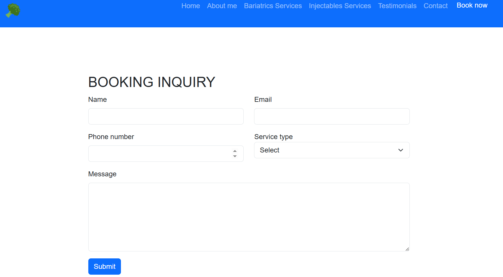
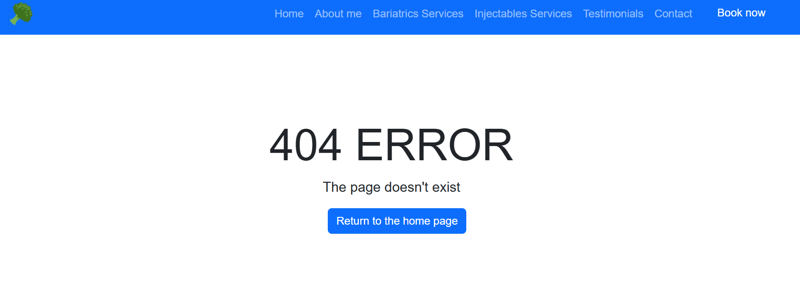

# Testing

> [!NOTE]  
> Return back to the [README.md](README.md) file.

## Code Validation

### HTML

I have used the recommended [HTML W3C Validator](https://validator.w3.org) to validate all of my HTML files.

| Directory | File | URL | Screenshot | Notes |
| --- | --- | --- | --- | --- |
| assets| [404.html](https://github.com/DavidClamp/new-milestone/blob/main/404.html) | [HTML Validator](https://validator.w3.org/nu/?doc=https://davidclamp.github.io/new-milestone/404.html)| |
|assets| [booking.html](https://github.com/DavidClamp/new-milestone/blob/main/booking.html) |[HTML Validator](https://validator.w3.org/nu/?doc=https://davidclamp.github.io/new-milestone/booking.html) |  |
 assets | [index.html](https://github.com/DavidClamp/new-milestone/blob/main/index.html) |[HTML Validator](https://validator.w3.org/nu/?doc=https://davidclamp.github.io/new-milestone/index.html) |  |
| assets| [success.html](https://github.com/DavidClamp/new-milestone/blob/main/success.html) | [HTML Validator](https://validator.w3.org/nu/?doc=https://davidclamp.github.io/new-milestone/success.html) |  | 

### CSS

- https://jigsaw.w3.org/css-validator/validator?uri=https://davidclamp.github.io/new-milestone

I have used the recommended [CSS Jigsaw Validator](https://jigsaw.w3.org/css-validator) to validate all of my CSS files.

| Directory | File | URL | Screenshot | Notes |
| --- | --- | --- | --- | --- |
| assets | [style.css](https://github.com/DavidClamp/new-milestone/blob/main/assets/css/style.css) | [CSS Validator](https://jigsaw.w3.org/css-validator/validator?uri=https://davidclamp.github.io/new-milestone) |  |

## Responsiveness

I've tested my deployed project to check for responsiveness issues.

| Page | Mobile | Tablet | Desktop | Notes |
| --- | --- | --- | --- | --- |
| Home |  |  |  | Works as expected |
| About Me |  |  |  | Works as expected |
| Bariatric Services |  |  |  | Works as expected |
| Injectable Services |  |  |  | Works as expected |
| Booking |  |  |  | Works as expected |
| Success |  |  |  | Works as expected |
| 404 |  |  |  | Works as expected |

## Browser Compatibility

I've tested my deployed project on Chrome and Microfoft Edge to check for compatibility issues. Chrome is my default browser and Edge comes with Microsoft Windows. I'm reluctant to download other browsers on my personal Laptop. Both browsers have no compatibility issues.

| Page | Chrome | Edge | Notes | 
| --- | --- | --- | --- |
| Home |  | | Works as expected |
| About Me |  |  | Works as expected |
| Bariatrics |  |  | Works as expected |
| Injectables |  |  | Works as expected |
| Testimonials |  | | Works as expected |
| Booking |  | |Works as expected |
| Success |  |  |Works as expected |
| 404 |  |  | Works as expected |

## Lighthouse Audit

I've tested my deployed project using the Lighthouse Audit tool to check for any major issues. Some warnings are outside of my control, and mobile results tend to be lower than desktop.

| Page | Mobile | Desktop |
| --- | --- | --- |
| Home |  |  |
| Booking |  |  |
| Success |  |  |
| 404 |  |  |

## Defensive Programming

Defensive programming was manually tested with the below user acceptance testing:

| Page | Expectation | Test | Result |
| --- | --- |  --- |  --- |
| Home | Feature is expected to display a description of why Bariatric patients and Injectable users should use this website. | Verified that the page displays the websites purposes in a clear and concise manner. | The purposes were displayed as expected. | 
| | Feature is expected to have accessible navigation links. | Checked navigation links for correct functionality and accessibility. | Navigation links were functional and accessible. | 
| | Feature is expected to be fully responsive. | Resized the browser window and tested on multiple devices (mobile, tablet, desktop). | The page was responsive across all tested screen sizes. |
| About Me | Feature is expected to provide background information an d photograph of main practitioner. | Confirmed that the page contains a structured description and photograph. | Page was displayed as expected. | 
| Bariatric Sevices | Feature is expected to display details of bariatric patients services on offer and take user to a booking page. | Verified that the page lists three services with buttons. | Service details were displayed as expected. Bottons link to booking page |
| Injectable Sevices | Feature is expected to display details of injectable users services on offer take user to a booking page. | Verified that the page lists three services and booking buttons. | Service details were displayed as expected. Bottons link to booking page |
| Testimonials | Feature is expected to showcase testimonials of previous clients. | Verified that the gallery contains clear images that aren't stretched, pixelated, and fully responsive. | Images are properly sized, and respond well to different device sizes. |
| Booking Form | Feature is expected to prevent submission of an empty form. | Attempted to submit the form without filling any fields. | Form submission was blocked, as expected. |
|| Feature is expected to enforce valid input types for each field. | Entered invalid data (e.g., random text in an email field, numbers in a name field, etc.). | Incorrect submissions are not submitted. 
|| Feature is expected to accept valid input types for each field. | Entered valid data (e.g., correct text in an email field, text in a name field, etc.). | Correct submissions are accepted. |
|Success page| Feature is expected to acknowledge successful completion of booking form | Entered valid data (e.g., correct text in an email field, text in a name field, etc.) and submitted form | Correct submissions acknowledged on via the success page. |
| Social Links | Feature is expected to include working links to the practices social platforms (Instagram, Facebook, etc.). | Clicked each social link to verify redirection to the correct platform page. | All links redirected to the correct platform pages, opening in new browser tabs. |
| 404 Error Page | Feature is expected to display a 404 error page for non-existent pages. | Navigated to an invalid URL (e.g., `/test`) to test error handling. | A custom 404 error page was displayed as expected. | 

### Known Issues
|
[!IMPORTANT]  
There are no remaining bugs that I am aware of, though, even after thorough testing, I cannot rule out the possibility.

